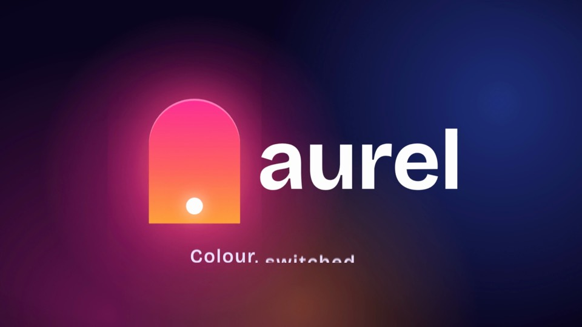
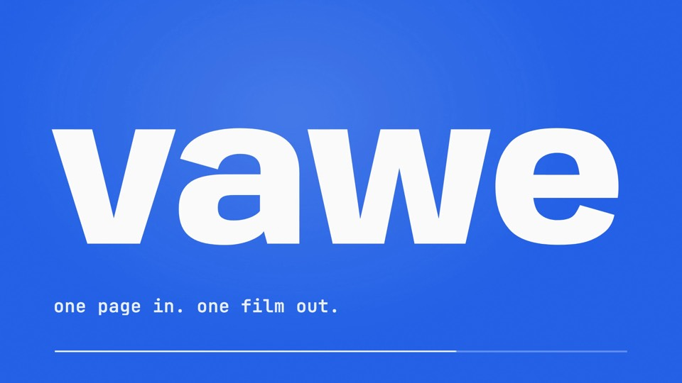
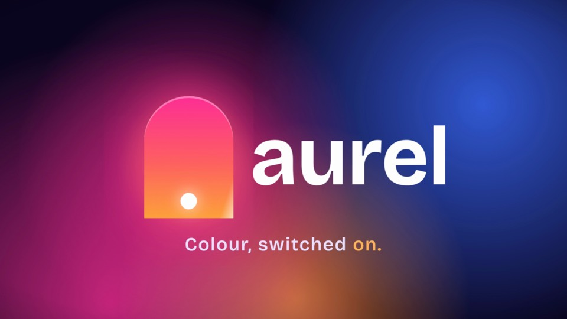

<!-- generated by harness/dev/taste-build.mjs from taste/rules: do not edit -->
# vawe taste card: short motion-graphics films

Contents:
- [concept](#concept)
- [look](#look)
- [motion](#motion)
- [transitions](#transitions)
- [finish](#finish)
- [sound](#sound)
- [attractors](#attractors)
- [anti-patterns](#anti-patterns)

One page, CSS and WAAPI, 5 to 40 s. The author reads taste/build/DIGEST.md at the brief. The judge scores against these 34 rules and the 5 anti-patterns below.
Every rule is observable from frames or from an ffmpeg measurement. Name the rule id in each fix.
Where the frames and the measurements disagree with a rule, the frames and the measurements decide.

## concept

### attractors

The hero comes from the direction, not from the list of things first drafts fall into. An attractor is fine only when the direction chose it and says why.

- Judge: Is the hero an attractor the direction did not choose?

### show-real-thing

Each beat shows a real artifact working: the real UI for a real product, the brand's own mark and world for an invented one. A word in a box is not a beat.

- Range: a capture, a drawn real artifact or a live demo in every beat that makes a claim
- Judge: Name the artifact that earns each beat. Which beat holds only a word in a box, chrome with no function or a click with no result?

### thread

One thread carries through the film: an object, a type line, a colour or a rhythm. Carry it in two registers (one literal, one subtle) so no single one has to be obvious.

- Range: 1 to 2 threads, named in the brief: an object, a type line, a colour or a rhythm
- Judge: Trace the thread across the sheet from row 1 to the last row: what survives each cut?

### three-materials

Three directions use three different materials. At most one is made of light.

- Limit: at most 1 of 3 directions made of light
- Range: materials: type, paper or print, liquid, cut geometry, photograph, UI, light
- Judge: Do the three directions use different materials, and is at most one made of light?

## look

### accent-share

One accent hue per film, scarce and visible. It colours the thing the beat is about. It never floods the frame.

- Limit: no frame where the accent covers the whole frame
- Range: accent 10 percent of a frame (up to about 25 percent for atmosphere); neutrals fill the rest; semantic colours stay distinct from the accent
- Judge: Is there a frame where the accent covers the whole frame? Does each accent colour decorate something?

### first-frame

Something of the subject (the subject, its ground or its first mark) is on screen at frame 0 and reads as an image by 0.1 s. Its motion may start 0 to 0.3 s later. Nothing arrives into an empty frame at t=0.

- Limit: a subject visible by 0.1 s; never an empty ground for the first 0.5 s
- Range: first motion starts 0 to 0.3 s after frame 0
- Judge: Does the frame at 0.1 s show a subject?

### one-focal-point

One focal point per frame and one accent colour per frame. The brightest and largest thing in the frame is the subject. The eye ranks brighter, then larger, then in focus, then moving.

- Range: one focal point off-centre, one accent colour
- Judge: Which one thing is the focal point, and is it the brightest and largest?

### palette-from-brand

Colours come from the brand or the brief: take them from the real pixels and the real CSS, and declare the palette once as :root custom properties.

- Range: a family (warm neutral, cool neutral, saturated, mono plus accent, duotone) with a ground, a surface, three text levels and one accent
- Judge: Does every colour trace to the kit or to a stated choice, and is any ground pure black or white?

### readable-hold

A line the viewer must read holds fully legible long enough to be read. When a hold is short, add hold time; never slow the move.

- Limit: no held frame under 1.2 s; short or non-prose text max(1.2 s, words / 3); prose (4 or more words) words x 0.6 s; each element is its own line, and rows that appear together need the longest row plus 1/3 s per extra row, at most the ceiling
- Range: one line holds at most about 5 s; past 8 words cut the line
- Judge: Count the legible tiles per line on the 5 fps sheet against the read-hold facts in the prompt (the same numbers as the draft check): is each line held long enough, and no longer than needed?

### readable-text-size

A line the viewer must read has a cap height of at least 6 percent of the frame height (about 65 px at 1080p).

- Limit: cap height at least 6 percent of frame height; product UI labels shown as texture (data-chrome) at least 2.5 percent
- Judge: Measure the cap-height band in one full frame: is it at least 6 percent?

### typeface-default

Use the kit's face and surface for a brand, or a face the direction chose. Do not pick Inter, Space Grotesk or another generator default by habit.

- Range: banned as defaults: Inter, Roboto, Open Sans, Noto Sans, Lato, Source Sans, PT Sans, Nunito, Poppins, Outfit, Sora, Playfair Display, Cormorant Garamond, Bodoni Moda, EB Garamond, Cinzel, Prata, Syne, Space Grotesk. Also not by default: Bricolage Grotesque, Instrument Serif, Fraunces, Archivo Black, DM Serif Display, Fredoka
- Judge: Does the face trace to the brand kit or to a stated direction?

### word-colour

Per-word colour goes on one or two words per line, and each coloured word is the word the beat is about.

- Range: 1 to 2 coloured words per line
- Judge: For each coloured word: what does it point at?

### world-turns

The world (ground, palette, composition) turns at least every 2 s or at each beat, whichever comes first. Tone changes per beat; the backdrop is always a decision, never a default.

- Limit: at most 8 near-identical tiles in a row on the 5 fps sheet, at most 4 at the tail; no data-world element visible longer than 2 s
- Range: a new element, a cut or a ground swap every 1 to 2 s
- Judge: The turns are the page's data-world spans, a new world is a turn even on the same ground. Count identical adjacent tiles on the sheet. Does each world last 2 s or less?

## motion

### entrance-ease

An entrance is a landing: it decelerates on EASE.land and shows most of its move by frame 1. It never starts from nothing.

- Limit: no scale(0) start; no slow-start curve (the CSS keywords ease-in or ease-in-out) on an entrance
- Range: EASE.land to arrive, EASE.landSoft for a move under 0.4 s; start scale at 0.9 to 0.97 with opacity 0
- Judge: Does frame 1 of an entrance already show most of the move? Does any entrance start at scale 0?

### entrance-origin

Motion explains: one entrance per beat, and it says where the thing came from (origin at its trigger, a wipe on the motion, a match on a shape). Vary the origin across elements.

- Range: origins: from left, from right, from scale, opacity only, letter-spacing, from the trigger
- Judge: Name each entrance's direction or origin. Is every element an opacity fade?

### exits-shorter

An exit is a launch: it runs shorter than its entrance and accelerates. A card takes 0.4 s to appear and 0.25 s to leave.

- Limit: an exit shorter than its entrance (the lint flags an exit as long as or longer)
- Range: exit 0.35 to 0.6 of the entrance duration; the presets leave() at 0.6
- Judge: Count the frames of one entrance and its exit on the sheet: is the exit shorter?

### live-hold

A hold keeps life through a part that moves inside the frame: a line typing, a counter, a glint, a secondary action. A readable hold is good; a frozen frame is not a hold. A camera drift or push does not count, the camera holds still by default.

- Limit: no span longer than 0.5 s outside a declared hold where no part of the frame moves by itself (a whole-frame move does not count)
- Range: an element move with slow ease at both ends; a rest of 0.4 to 0.6 s after an element settles
- Judge: Is there a 0.5 s span where nothing moves and no hold is declared?

### named-eases

Take every curve from the EASE names (exact linear()), not from a CSS keyword and not from a hand-fitted cubic-bezier. The CSS keywords ease, ease-out and ease-in-out are not a default for everything.

- Limit: a move longer than 0.3 s is not on linear or on a bare CSS keyword with no curve of its own
- Range: EASE.land, landSoft, settle, swap, glide, carry, leave, launch, pop, nudge; sampled springs with 8 or more stops
- Judge: Is any move on a bare keyword or a hand-fitted bezier? Does frame 1 jump?

### no-bounce

No bounce or overshoot on type or UI by default. Overshoot is a claim about mass.

- Range: EASE.pop (about 15 percent overshoot) only where the point of the move is a press or a pop, named in the page; one accent moment per film
- Judge: Does any word or UI element overshoot with no stated reason?

### real-physics

Real physics, not an imitation: a spring or an exponential as sampled keyframes or linear() with 8 or more stops, and a named effect that looks like its real-world thing.

- Range: a spring as duration plus bounce (springLinear, springDuration)
- Judge: Does a full frame mid-effect match the physical object? Does the move stop early?

### speed-bands

Speed is a voice. Every move sits in a named band, and the slowest move runs at least 3 times the fastest move. Never every move at one duration.

- Limit: the slowest move at least 3 times the fastest move; not all moves in one band
- Range: energy 0.15 to 0.3 s; professional 0.3 to 0.5 s; gravity 0.5 to 0.8 s; cinematic 0.8 to 2 s only when the film has the seconds. By role: ambient 0.8 to 1.2 s, thesis line 0.5 to 0.8 s, heavy title 0.5 to 0.7 s, caption 0.25 to 0.4 s, payoff snap 0.25 to 0.35 s. Frame counts at 60 fps (finals) or in seconds
- Judge: List each move's duration on the sheet: is the longest at least 3 times the shortest?

### stagger

A group reads as one beat with an inner rhythm: not a chord on one frame and not a queue.

- Limit: no 3 or more elements landing on one frame at 60 fps; the whole run at most 0.5 s
- Range: 30 to 80 ms between siblings (engine default 45 ms); calm 80 to 120 ms. The total (n minus 1) times the gap, so delay = 0.5 / (n minus 1) capped at 80 ms; past about 7 items stagger a few and bring the rest as a block; board cards 60 to 90 ms
- Judge: Do siblings land on one frame, or does the last land in another beat?

## transitions

### crossfade-limit

A crossfade is not the only transition, and a crossfade between two busy frames goes muddy.

- Judge: Is a crossfade the only transition, or does it blend two busy frames?

### eye-trace

Land the incoming subject where the eye was on the outgoing frame. Do not make the eye cross the frame at a seam.

- Limit: the incoming subject lands within 0.30 of the frame diagonal of the outgoing focal point
- Judge: Compare the last frame before and the first frame after each cut: the focal point's distance.

### seam-variety

Each moving seam changes axis or direction from the previous moving seam, and the same moving seam never appears twice. A hard cut is exempt.

- Limit: no full-frame transition move twice in a row
- Range: moving seams: wipes, pushes, whips, zooms; rotate inside one family (soft, motion, shape, spatial)
- Judge: Compare the last frame before and the first frame after each moving seam: direction and axis.

## finish

### gradient-grain

A gradient the brief asks for is clean. h264 bands a slow dark ramp in the mp4 even when the browser looks clean.

- Limit: no banding rings and no straight edge inside a glow
- Range: 1 to 2 percent grain on dark gradients; hold a grain pattern 2 frames; prefer a radial and a short ramp
- Judge: On a full frame at the darkest moment and at the brightest glow, are there banding rings or a straight seam?

### mark-rides-parent

Every mark rides the thing it belongs to. A mark that sits still while its parent moves, or points at nothing, is a stray.

- Judge: For any small mark: name its parent and confirm it moves with it.

### moving-tail

The world keeps moving to the last frame: the last second carries a small move on a part or the ground. A wordmark may land and hold, but something still moves.

- Limit: no static frame in the last 1 s; at most 4 near-identical tail tiles, unless an animation runs on a visible element through the last 1 s on the sheet
- Range: a slow part or ground move through the last second
- Judge: Does anything move in the last second?

### no-tells

No generated tells. Each one reads as made without a direction.

- Range: banned unless the brief asks: gradient text, a cyan to purple gradient the brand does not own, corner labels, frame borders, registration marks, glow on UI text, particle bursts, shockwave rings, RGB split, camera shake, lens flares, a centred title on a gradient
- Judge: Scan every frame for the listed effects. Is each one asked for or declared?

### reveal-mask-pad

A reveal mask clears the glyphs. Never letters cut by their own reveal.

- Limit: pad the clip box at least 0.3 em below the baseline and above the cap height
- Judge: On a full frame mid-reveal, is every descender whole?

### stock-device-once

A stock device is seasoning, never the idea. Use it at most once per film.

- Limit: a sheen band, lens streak, light beam, accent bar or rule line at most once per film
- Range: effects are seasoning: 2 to 3 earned moments in a 45 s film (the hero reveal, an act break, the CTA)
- Judge: Count the sheen bands, streaks, beams, accent bars and rule lines.

## sound

### sound-level

Sound is subtle: low peak, quiet mix. What you write is what you hear: no normalising, default gains.

- Limit: true peak at or below -3 dBFS
- Range: integrated loudness about -20 LUFS (the draft check warns outside -24 to -16); default gains: palette tap -3 dB, tick, air, swoosh-long and sub-thump -5; the old voices soft -6 dB, whoosh, riser and swell -4, impact and drop -2; one palette cue per beat lands near -20 LUFS
- Judge: Read the measured peak and loudness: are they at or below -3 dBFS and near -20 LUFS?

### sound-swell

At most one soft swell, and it ends on a cut. A whoosh on every transition makes every transition equally important, so none is.

- Limit: at most 1 swell per film
- Range: a whoosh only on a layer that really crosses the frame, its length matching the move; score the 2 to 3 seams that earn it
- Judge: How many swells? Is there a whoosh on every cut?

### sound-voices

Small effects on actions carry the film, with no synth bed, pad or chord. Prefer real recorded effects; the quiet synth ticks are the fallback. Weight voices are for a brief that asks for weight.

- Range: accent: pluck, chime, sparkle, droplet; confirm: bloom, success, ready; weight (impact, drop, riser) only when the brief asks
- Judge: Is there a synth bed, pad or chord, or an impact, drop or riser the brief did not ask for?

## attractors

First drafts fall into these. Each is fine only when the direction chose it on purpose and says why; as a default it is the tell (rule attractors). The range check in `bin/vawe dev` reads the names and shapes it flags from `taste/attractors.json`.

- A glowing circle, orb or disc as the hero, above all a flat disc with no light source.
- A dusk sun or a crescent, and the name Vesper or a similar light-poetry name.
- Lens streaks, light-beam or sheen-band sweeps; accent bars and rule lines under a word.
- The same seam move twice.
- A finance, invoice or accounts tool as the invented product.
- Three directions in one material.

## anti-patterns

Frames from our private films. Each text names the film and the time.

### A. The empty opening

 a 5 s sting (private) at 0.1 s. A dark mesh, no subject. The dot appears at about 0.5 s. Breaks first-frame.
Fix: put the subject in frame 0: the thread, the first word or the brand colour. Start the sound at 0 as well.

### B. The reveal cuts the letters

 a 5 s sting (private) at 2.5 s. "Colour, switched" rises through a hard horizontal mask; the descenders and the top of "switched" are sliced flat. A straight glow seam is also visible at x=860, left of "aurel". Breaks reveal-mask-pad, gradient-grain.
Fix: pad the mask box 0.3 em past the glyph bounds, or reveal with blur and translate and no clip edge. Remove the clipped edge on the glow layer.

### C. The stray dot

 its second version (private) at 4.6 s. A white dot sits below "r", detached from the arch and the wordmark, while the arch's sweep plays. Breaks mark-rides-parent.
Fix: a mark rides its parent or leaves. Tie it to the thing that moves (the arch's sweep), or delete it the moment it points at nothing.

### D. One colour field for half the film

 the vawe sting (private) at 3.5 s. The scene cuts stop at 2.3 s; the same cobalt lockup holds until 5.0 s, 2.7 s of a 5 s film, and the whole frame is the accent colour. Breaks world-turns, accent-share.
Fix: ground #16151a with white type; cobalt only on the caret. Swap the ground or cut a new element within 2 s of the expansion, and keep something moving in the last 0.5 s.

### E. The static lockup tail

 a 5 s sting (private) at 4.5 s. Arch, wordmark and tagline landed one after another, then nothing moves from 3.9 s to 5.0 s; the tagline cap height is about 4.6% of the frame. Breaks moving-tail, thread, readable-text-size.
Fix: carry one thread through the lockup (the tagline's key word takes the accent at about 3.6 s), raise the tagline to 65 px or more, and end on that motion, not on a hold.
